# Henry

Henry is the robot mascot of [curthenrichs.github.io](https://curthenrichs.github.io/) and
[half-built-robots.com](https://www.half-built-robots.com/). He's a friendly little robot with a
glowing antenna who waves hello while pages load and apologizes when one has gone missing, and he
keeps the sites feeling human while their actual human is busy soldering.

<p align="center">
  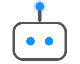
  &nbsp;&nbsp;&nbsp;
  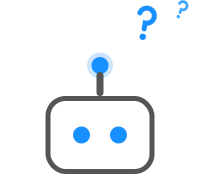
</p>

**Why "Henry"?** The henry is the SI unit of inductance. It's also the first syllable of
Henrichs. A personal monogram, expressed in physics.

Henry shares his brand universe with **Bubbles**, the robot dog project over at Half-Built Robots.

## The character

Henry is drawn as just a head. That's the whole robot, and that's the joke: he's a half-built
robot.

He comes in two forms:

- **Icon form** (dark ground, no outline): white head on navy or black, used for favicons and
  app icons. The ground does the outlining.
- **Illustration form** (transparent ground, `#555555` outline): his portrait for light
  surfaces, matching the animated component on the portfolio's 404 page and loading veil. The
  outline stays gray in every colorway. Fifteen moods ship in `dist/`; the expression gallery
  below has the full roster.

- **Head:** white rounded rectangle, 1.4:1 width-to-height ratio (canonically 109×78 in CSS,
  300×214 in the 512 master)
- **Eyes:** two round accent-colored dots; they blink
- **Antenna:** a single stem with a glowing accent-colored tip. This is Henry's signature and
  it never comes off
- **Moods:** every expression is a combination of three channels — eye shape, antenna
  state, and stroke-drawn manga symbols (emanata). The grammar and the per-mood specs
  live in the [expression design doc](docs/superpowers/specs/2026-07-03-henry-expressions-design.md).
  The two load-bearing rules: the antenna must agree with the eyes (it's the mood
  barometer), and the antenna tip stays a glowing ball except in robot moods, where it
  may swap to hardware (a plug, a dish, a spark). *Friendly* (blinking, pulsing) and
  *confused* (question marks, boing) remain the two moods with living animated
  implementations in the portfolio's `CuteRobot` component.

The living animated implementation is the `CuteRobot` React component in the
[portfolio repo](https://github.com/curthenrichs/curthenrichs.github.io)
(`src/components/CuteRobot.jsx`), which also documents the animation timings.

## Gallery

| Form | portfolio-blue | half-built-robots-amber |
|---|---|---|
| Icon, 512 master | 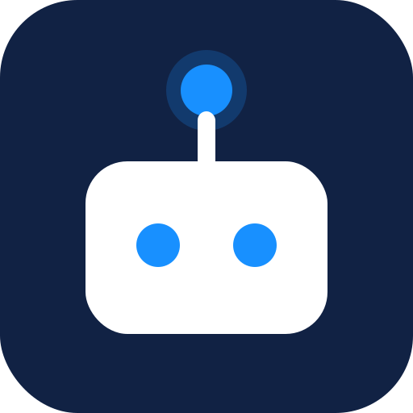 | 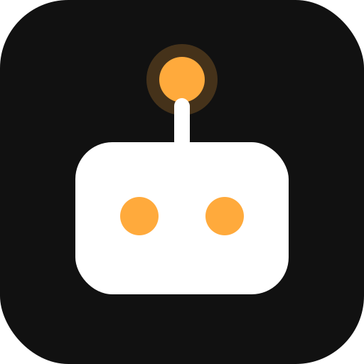 |
| Icon, pixel-fitted 32 (shown 2×) | 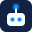 |  |
| Icon, pixel-fitted 16 (shown 2×) | 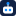 | 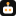 |

### Expressions

| Mood | portfolio-blue | half-built-robots-amber |
|---|---|---|
| Friendly |  | 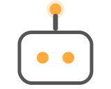 |
| Confused |  | 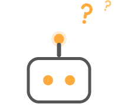 |
| Happy | 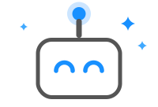 | 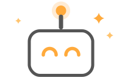 |
| Sad | 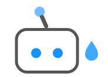 | 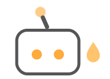 |
| Surprised | 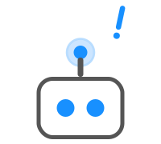 | 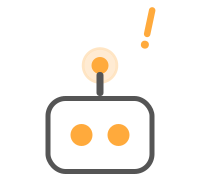 |
| Sleepy | 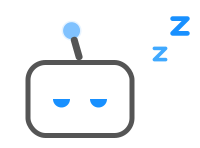 | 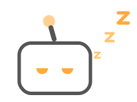 |
| Love | 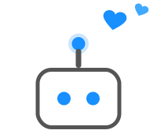 | 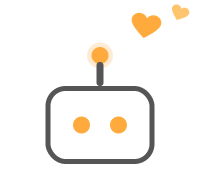 |
| Dizzy | 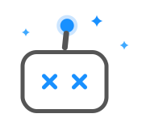 | 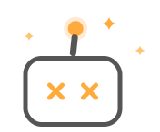 |
| Pouty | 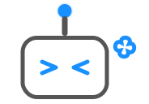 | 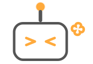 |
| Glitched | 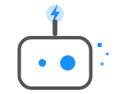 | 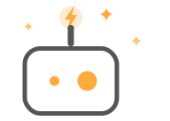 |
| Signal lost | 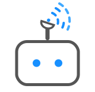 | 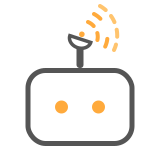 |
| Charging | 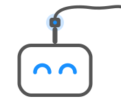 | 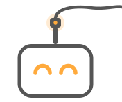 |
| Broadcasting | 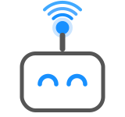 | 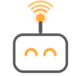 |
| Rebooting | 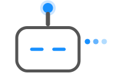 | 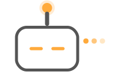 |
| Low battery | 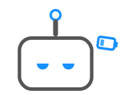 | 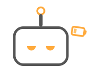 |

## Palettes

Henry has one official colorway per site. His head is always white; ground and accent change.

| Token | portfolio-blue | half-built-robots-amber |
|---|---|---|
| Ground (icon form) | `#112244` navy (sampled from the site's original favicon) | `#111111` near-black (theme's terminal aesthetic) |
| Accent (eyes, antenna tip, glow) | `#1890ff` (Ant Design primary blue) | `#ffaa3c` (theme `--primary-color`) |
| Secondary accent (small question mark) | `#40a9ff` (Ant Design blue-5) | `#ffc46e` (lighter amber, defined in this repo) |
| Head | `#ffffff` | `#ffffff` |
| Outline + stem (illustration form) | `#555555` | `#555555` |
| Glow halo | accent @ 22% (512, illustrations) / 28% (32px) opacity | same |

In the icon form the antenna stem is white so the silhouette stays a two-color mark; in the
illustration form the stem is gray like the outline, matching the CSS component.

## Design rules

1. **No outline on dark grounds.** The `#555555` outline belongs to the illustration form and
   light backgrounds. On navy or black icon grounds the white head *is* the shape.
2. **Glow only at 32px and up.** The antenna halo disappears at 16px because at that size it
   turns to mush.
3. **Small sizes are redrawn, not scaled.** `henry-32.svg` and `henry-16.svg` are pixel-fitted:
   geometry snaps to the pixel grid, eyes grow and spread, the antenna stem widens (32px) or
   shrinks to a 1px stem plus dot (16px).
4. **Antenna always present.** It's what makes the silhouette read "robot" instead of "chat app."
5. **Don't stretch, rotate, or recolor outside the official palettes.** New colorways get added
   to `scripts/generate.js` as variants, with their source documented here.
6. **Expressions follow the grammar.** A new mood is a combination of eye shape, antenna
   state, and stroke-drawn emanata per the
   [expression design doc](docs/superpowers/specs/2026-07-03-henry-expressions-design.md);
   the antenna tip morphs into hardware only in robot moods.

## Repo layout

```
artwork/    SVG masters, authored in the canonical (portfolio-blue) palette
  henry-master.svg                  512 viewBox, source for the 180/192/512 outputs
  henry-32.svg                      pixel-fitted 32, source for the 32 output and 48 ICO layer
  henry-16.svg                      pixel-fitted 16, source for the 16 output and 16 ICO layer
  henry-illustration-<mood>.svg     outlined portraits, one per mood (15 moods; the list
                                    lives in ILLUSTRATION_MOODS in scripts/generate.js)
scripts/
  generate.js        recolors masters per variant, rasterizes, verifies
dist/               committed generated output; consumers vendor from here
  portfolio-blue/
  half-built-robots-amber/
```

Each `dist/<variant>/` contains: `favicon.ico` (16/32/48 layers), `favicon-16x16.png`,
`favicon-32x32.png`, `apple-touch-icon.png` (180), `android-chrome-192x192.png`,
`android-chrome-512x512.png`, one transparent illustration PNG per mood (4× the master's viewBox width), plus recolored
copies of all eighteen SVGs. Illustration emanata (question marks, sparkles, hearts, and
the rest) are stroke-drawn paths, not text, so they render identically everywhere with no
font dependency.

## Regenerating

```
npm install
npm run generate
```

The generator hard-fails on any wrong dimension or ICO layer count. Never hand-edit files in
`dist/`. Change the masters (or a variant's palette) and regenerate.

Note: this repo lives under a path with spaces on the maintainer's machine, so avoid `npx`.
Plain `npm run` and `node scripts/generate.js` work fine.

## Consumers

- **curthenrichs.github.io** vendors the `dist/portfolio-blue/` icon files into `public/`
  (filenames match one-to-one).
- **half-built-robots.com** (WordPress): upload `dist/half-built-robots-amber/android-chrome-512x512.png`
  as the Site Icon (Appearance → Customize → Site Identity) and WordPress derives the rest.

## License

Henry (the character, the name, and the artwork) is © Curt Henrichs, all rights reserved. He's a
brand mascot, not clip art, so please don't reuse him for other projects. The generator script is
trivial plumbing; feel free to adapt that pattern for your own mascot.
